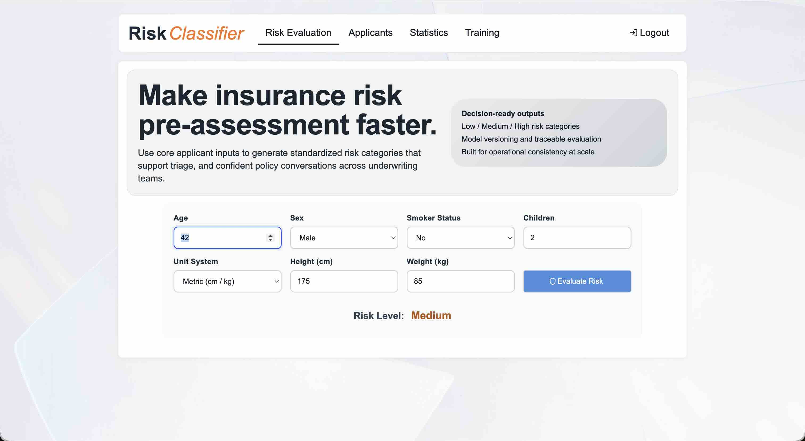
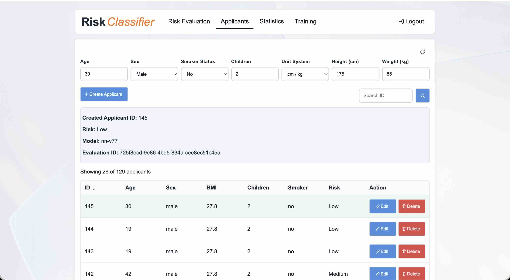
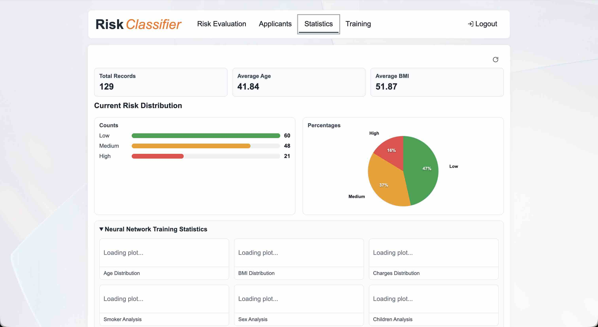
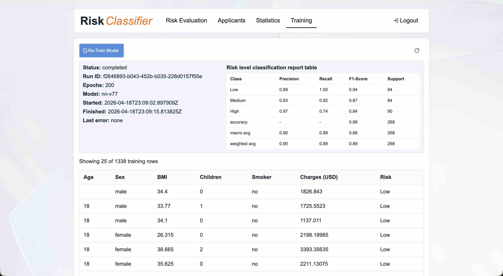

# WSAA-big-project
Health Insurance Risk Classifier web app for the Web Services and Applications project.

## Business Functionality
- `Risk Evaluation`: fast pre-assessment for a single person using age, sex, BMI, children, and smoker status; returns a Low/Medium/High risk category and model version used.
- `Applicants`: operational applicant management (create, list, search by ID, edit, delete) with risk evaluations attached, so teams can manage and review customer records in one place.
- `Statistics`: portfolio-level insight for decision support, including summary KPIs (records, average age/BMI/charges), risk distribution, and analytics plots.
- `Training`: model operations tab to retrain the classifier, monitor run status and model version, view classification report metrics, and inspect training dataset rows.

## Quick Start (Docker Compose)

Run the full local stack with one command:

```bash
docker compose up --build
```

This starts SQL Server, Azurite, backend, frontend, CSV seeding, and first-run model bootstrap.

- Architecture: `SYSTEM_ARCHITECTURE.md`

- Frontend: http://localhost:4200
- Backend API: http://localhost:8000
- SQL Server: `localhost:1433`
- Azurite blob endpoint: `http://localhost:10000`

Notes:

- `bootstrap-data` uploads `backend/data/health_insurance_data.csv` to blob storage.
- `bootstrap-model` triggers training only when no loadable model exists.
- SQL data is stored in persistent database `hirc` (created automatically by `init-db`).
- Local Docker auth is disabled:
  - Backend: `WSAA_AUTH_ENABLED=false`
  - Frontend: `frontend/src/assets/env.docker.js`

Optional overrides:

```bash
export WSAA_SQL_SA_PASSWORD='Your_password123'
export WSAA_SQL_DATABASE='hirc'
export WSAA_BOOTSTRAP_EPOCHS='200'
docker compose up --build
```

## Environment Variables

### Required (backend)

- `WSAA_DB_CONNECTION_STRING`
- `WSAA_AZURE_STORAGE_CONNECTION_STRING`

### Optional (backend)

- `WSAA_CORS_ORIGINS`
- `WSAA_AZURE_STORAGE_PREFIX`

### Auth settings (required only when `WSAA_AUTH_ENABLED=true`)

- `WSAA_AUTH_ENABLED`
- `WSAA_AUTH_TENANT_ID`
- `WSAA_AUTH_CLIENT_ID`
- `WSAA_AUTH_AUDIENCE`
- `WSAA_AUTH_REQUIRED_SCOPE`
- `WSAA_AUTH_ALLOWED_ISSUERS`

### Frontend runtime config

- `frontend/src/assets/env.js`
  - `apiBaseUrl`
  - `auth.enabled`
  - `auth.tenantId`
  - `auth.clientId`
  - `auth.apiScope`

## Local Dev (without Compose)

Use this section only if you do not want Docker Compose.

```bash
# backend
python -m pip install -r backend/requirements.txt
cd backend
uvicorn src.main:app --reload
```

```bash
# frontend (new terminal)
cd frontend
npm install
npm start
```

If you change `backend/openapi.yaml`, regenerate clients/stubs:

```bash
./backend/scripts/generate_openapi_models.sh
./frontend/scripts/generate-api-client.sh
```

- Backend container image is built from `backend/Dockerfile` and pushed by `azure-pipelines.yml`.
- Backend is deployed to Azure Container Apps using `az containerapp update`.
- Frontend is built with Angular and deployed to Azure Static Web Apps.
- Set pipeline variables/secrets before running release:
  - `dockerRegistryServiceConnection`
  - `azureServiceConnection`
  - `acrLoginServer`
  - `resourceGroup`
  - `containerAppName`
  - `azureStaticWebAppsApiToken`
- For frontend API target, set `frontend/src/assets/env.js` `apiBaseUrl` to your Container App URL for release.

- Backend image: `backend/Dockerfile` (pipeline: `azure-pipelines.yml`)
- Backend deploy target: Azure Container Apps
- Frontend deploy target: Azure Static Web Apps
- Set pipeline secrets/variables before release (`WSAA_DB_CONNECTION_STRING`, `WSAA_AZURE_STORAGE_CONNECTION_STRING`, auth vars, `azureStaticWebAppsApiToken`)

## CI/CD Pipeline (Azure DevOps)

- Automated builds and deployments are managed via Azure DevOps.
- On each push or pull request:
  - Backend Docker image is built and pushed to Azure Container Registry.
  - Backend is deployed to Azure Container Apps.
  - Frontend is built and deployed to Azure Static Web Apps.
- Pipeline configuration: [`azure-pipelines.yml`](azure-pipelines.yml)
- Required pipeline secrets/variables:
  - `dockerRegistryServiceConnection`
  - `azureServiceConnection`
  - `acrLoginServer`
  - `resourceGroup`
  - `containerAppName`
  - `azureStaticWebAppsApiToken`
  - `WSAA_DB_CONNECTION_STRING`
  - `WSAA_AZURE_STORAGE_CONNECTION_STRING`
  - (auth variables if enabled)

## Application Screenshots

### Risk Evaluation Tab

_Evaluate individual risk using age, sex, BMI, children, and smoker status._

### Applicants Tab

_Manage applicants: create, search, edit, delete, and view risk evaluations._

### Statistics Tab

_See portfolio-level KPIs, risk distribution, and analytics plots._

### Training Tab

_Trigger model retraining, monitor status, and inspect training data._
