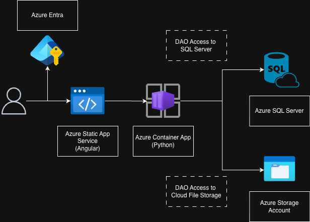

# SYSTEM ARCHITECTURE

Health Insurance Risk Classifier platform with:
- Angular frontend
- Azure Entra ID is used for user authentication and authorization.
- Python FastAPI backend (API server)
- Azure SQL database for persistent storage accessed by DAOs
- Azure Blob Storage for model artifacts and plots accessed by DAOs

Here a diagram of the system architecture:

The platform evolves the original analytics prototype into a full-stack web application with:
- OpenAPI contracts
- Persistent storage (SQL, Blob)
- Model-backed predictions
- Analytics and training workflows

## Key Domain Naming
- `applicants`: CRUD for applicant data
- `evaluations`: risk evaluation endpoints
- `training`: model training and status
- `metadata`: model registry and version info
- `statistics`: summary stats and plot endpoints

## Architecture Principles
- API-first: `backend/openapi.yaml` is the contract source of truth
- Contract-driven: backend models/routes generated from OpenAPI
- Layered backend: API, service, model adapter, repository
- Cloud-ready: stateless API, managed SQL, managed hosting, blob storage

## Tech Stack
- Frontend: Angular (TypeScript)
- Backend: Python FastAPI
- API contract: OpenAPI 3 (`backend/openapi.yaml`)
- Persistence: Azure SQL (local via Docker, cloud via Azure)
- Model/plot storage: Azure Blob Storage (local: filesystem)
- Deployment: Azure Web App, Azure SQL, Azure Blob

## High-Level System Components
1. **Frontend (Angular)**
   - Runs in browser, calls backend endpoints from OpenAPI contract
   - Uses generated API client
   - Provides forms, results, management views

2. **API Layer (FastAPI)**
   - Exposes REST endpoints for all domains
   - Validates requests/responses via generated OpenAPI models
   - Handles auth, errors, HTTP semantics

3. **Service Layer**
   - Orchestrates business logic (predict, persist, batch, training)
   - Applies domain rules, coordinates model/repository
   - Keeps route handlers thin

4. **Model Adapter Layer**
   - Loads and runs a risk model (TensorFlow/Keras)
   - Supports versioned model artifacts (from Blob or local)
   - Loads active model for evaluation
   - Isolated from API handlers

5. **Data Access Layer (Repository)**
   - SQL operations for applicants, evaluations, training runs, analytics
   - Abstracts storage for local and Azure SQL
   - Manages schema, constraints, queries

6. **SQL Database**
   - Stores applicant records, evaluation results, model metadata, training runs, analytics
   - Supports reporting/history, batch outputs

7. **Model Registry & Artifact Storage**
   - Model files (`risk_model*.keras`) and registry (`model_registry.json`) in Blob Storage (local: `backend/data/`)
   - Plots and analytics outputs in Blob Storage (local: `backend/plots/`)
   - Registry tracks model versions, metadata

8. **Analytics/Training Script**
   - Python script (`health_insurance_risk_classifier.py`) for EDA, training, evaluation
   - Loads data from CSV, trains model, saves artifacts/plots
   - Used by API for training runs and batch analytics

9. **External Integration**
   - Imports applicant data from CSV for batch training
   - Uses service/model adapter for consistency

## Data Flows

### Single Evaluation Flow
1. Angular sends evaluation input to FastAPI via `POST /v1/evaluations/risk`
2. FastAPI validates the request via OpenAPI schema
3. Service loads active model from Blob/local
4. Service runs inference, persists request/result to SQL
5. API returns risk category and metadata to frontend

### Training Run Flow
1. Client starts training with `POST /v1/training/run`
2. API starts training workflow, returns run metadata
3. Training script loads data, trains model, saves artifact to Blob/local
4. Model registry updated, status available via `GET /v1/training/status` and `GET /v1/training/status/{run_id}`

### Applicant CRUD Flow
- **List applicants:** `GET /v1/applicants`
- **Create applicant:** `POST /v1/applicants`
- **Get applicant by id:** `GET /v1/applicants/{applicant_id}`
- **Update applicant:** `PUT /v1/applicants/{applicant_id}`
- **Delete applicant:** `DELETE /v1/applicants/{applicant_id}`

### Statistics & Plots Flow
- **Get summary statistics:** `GET /v1/statistics/summary`
- **List plot files:** `GET /v1/statistics/plots`
- **Get plot image:** `GET /v1/statistics/plots/{plot_name}`
- API loads summary from SQL, plot files from Blob/local
- API returns stats and plot URLs or images to frontend

## Data Domains
- Applicants: demographic fields
- Evaluations: input, risk, model version, timestamp
- Model metadata: version, labels, features
- Training runs: run id, status, epochs, model version, timestamps, errors
- Analytics/plots: summary stats, plot images
- Model registry: tracks available model versions

## Repository Path Map
- API entry: `backend/src/main.py`
- Routers: `backend/src/applicant/router.py`, etc.
- Analytics: `backend/src/health_insurance_risk_classifier.py`
- API contract: `backend/openapi.yaml`
- Frontend: `frontend/src/`
